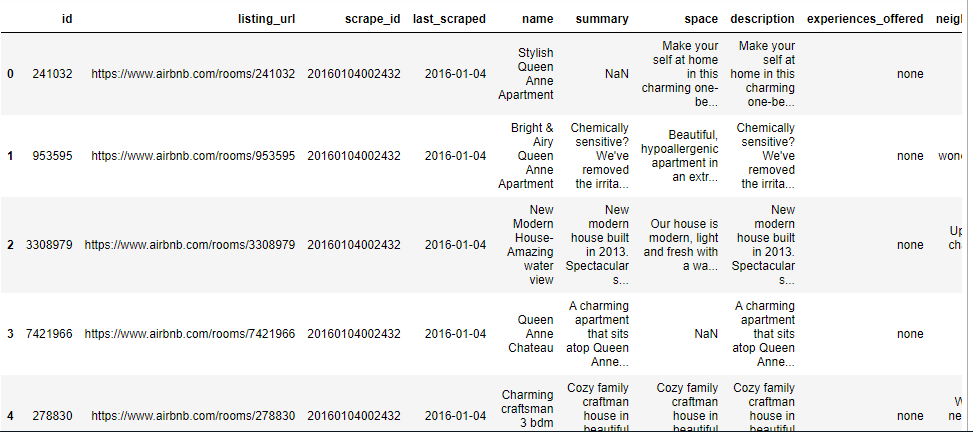
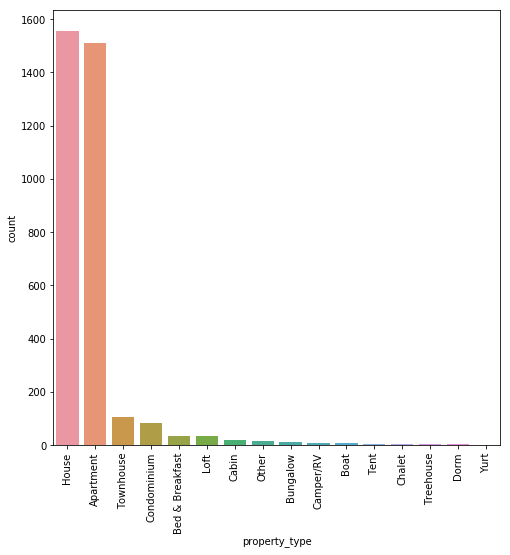
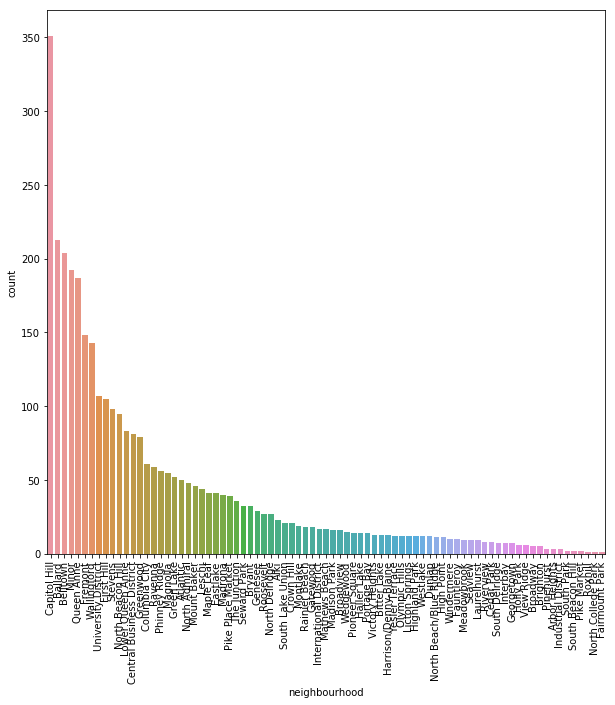
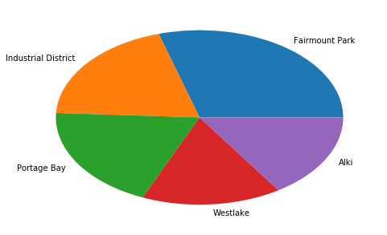
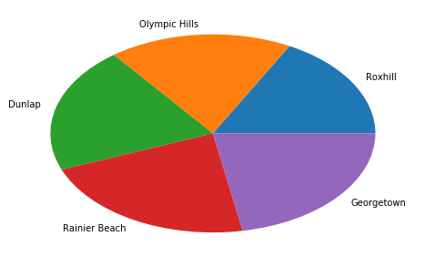

AS a part of the Udacity data scientist nanodegree, this blog post presents 3 business questions about Seattle Airbnb Dataset. The reference of the dataset is presented at the end of the post.
The dataset contains the listing details of homestays inSeatle. 3818 listings details are available in the dataset (92 features) as shown below:




### Here, there are 3 business questions asked that we are trying to answer:
1.	Which type of properties has the highest number of hosts?
2.	What are the top 5 neighborhoods that have the maximum number of hosts?
3.	Which neighborhoods have the highest average of prices and the neighborhoods have the lowest average of prices?

## Question 1: Which type of properties has the highest number of hosts? 
In the listing dataset there are 16 types of properties. The types of properties that have the maximum number of hosts are houses and apartments. Houses represent 45.75% of the listings where apartments represent 44.46% of the listings. The below chart shows the count of properties according to each type.  
 
  

## Question 2: What are the top 5 neighborhoods that have the maximum number of hosts?
The hosts in the listings are offered within 81 neighborhoods. However, there are some neighborhoods have more number of hosts. The data shows that 10.32% of the hosts are located in “Capitol Hill”. Here are the top 5 neighborhoods that have the maximum number of hosts:

```markdown
•	Capitol Hill    10.320494
•	Ballard          6.262864
•	Belltown         5.998236
•	Minor            5.645398
•	Queen Anne       5.498383
```

The chart below shows the number of hosts for every neighborhood:

  


## Question 3: Which neighborhoods have the highest average of prices and the neighborhoods have the lowest average of prices?
According to the data, “Fairmount Park” has the highest average of prices where where “Roxhill” is the neighborhood that has the lowest average of prices. The list below shows the top 5 neighborhoods and the low 5 neighborhoods according to the average of prices.

```markdown
Top 5 neighbourhoods :

Neighborhood          price
                  
Fairmount Park       370.000000
Industrial District  245.000000
Portage Bay          241.428571
Westlake             197.000000
Alki                 196.652174
```
The pie chart below shows thoes top 5 neighbourhoods:

  

```markdown
 Low 5 neighbourhoods :

neighbourhood   price
           
Roxhill        60.000000
Olympic Hills  63.666667
Dunlap         71.750000
Rainier Beach  76.722222
Georgetown     77.000000
```

The pie chart below shows those low 5 neighbourhoods:

 
